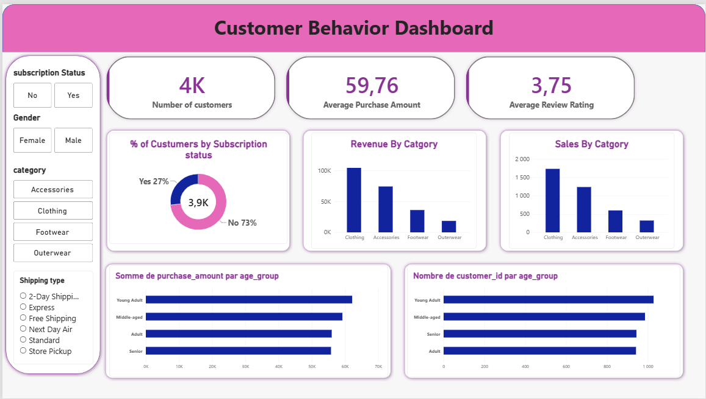

## 📌 Project Overview

This project analyzes **customer shopping behavior** using transactional data from **3,900 purchases** across various product categories. The objective is to uncover insights into **spending patterns, customer segments, product preferences, and subscription behavior** to guide strategic business decisions.

**Tech Stack:**  
`Python` · `Pandas` · `PostgreSQL` · `Power BI`

---

## 📊 Dashboard Preview



> Interactive Power BI dashboard highlighting KPIs, revenue distribution, subscription rates, and age-group performance.

---

## 🎯 Business Questions Answered

| # | Question | Insight |
|---|----------|---------|
| 1 | Revenue by Gender | Male: **$157,890** · Female: **$75,191** |
| 2 | High-Spending Discount Users | **839 customers** used discounts yet spent above average |
| 3 | Top 5 Products by Rating | Gloves (3.86), Sandals (3.84), Boots (3.82), Hat (3.80), Skirt (3.78) |
| 4 | Shipping Type Comparison | Express ($60.48) > Standard ($58.46) |
| 5 | Subscribers vs Non-Subscribers | Subscribers: $59.49 avg · Non-subscribers: $59.87 avg |
| 6 | Discount-Dependent Products | Hat (50%), Sneakers (49.66%), Coat (49.07%), Sweater (48.17%), Pants (47.37%) |
| 7 | Customer Segmentation | Loyal: 3,116 · Returning: 701 · New: 83 |
| 8 | Top 3 Products per Category | Jewelry, Blouse, Sandals, Jacket (leaders per category) |
| 9 | Repeat Buyers & Subscriptions | 958 repeat buyers subscribed vs 2,518 non-subscribers |
| 10 | Revenue by Age Group | Young Adults & Middle-aged drive the highest revenue |

---

## 📂 Repository Structure
```
├── analysis.ipynb                          # Python data cleaning, EDA & feature engineering
├── EDA.sql                                 # SQL business queries (PostgreSQL)
├── customer_shopping_behavior.csv          # Raw dataset (3,900 rows × 18 columns)
├── customer_behavior_dashboard.pbix        # Power BI interactive dashboard
├── dashboard_screenshot.png                # Dashboard preview image
└── README.md
```

## 🧹 Data Preparation (Python — `analysis.ipynb`)

- **Dataset:** 3,900 rows × 18 columns
- **Missing Data:** 37 values in `Review Rating` → imputed using **median rating per product category**
- **Column Standardization:** Renamed all columns to `snake_case`
- **Feature Engineering:**
  - `age_group` — binned customer ages (Young Adult, Middle-aged, Adult, Senior)
  - `purchase_frequency_days` — derived from purchase frequency
- **Data Consistency:** Verified `discount_applied` and `promo_code_used` were redundant → dropped `promo_code_used`
- **Database Integration:** Loaded cleaned DataFrame into **PostgreSQL** for structured SQL analysis

📓 Full notebook → [`analysis.ipynb`](analysis.ipynb)

---

## 🔍 SQL Analysis (PostgreSQL — `EDA.sql`)

All 10 business questions were answered using structured SQL queries:

- Aggregations (`SUM`, `AVG`, `COUNT`)
- Conditional logic (`CASE WHEN` for segmentation)
- Ranking (`RANK()`, `ROW_NUMBER()` for top products)
- Grouping by demographics, category, and subscription status

🔎 Full queries → [`EDA.sql`](EDA.sql)

---

## 📊 Power BI Dashboard

**Key KPIs displayed:**
- 👥 Number of Customers: **3.9K**
- 💰 Average Purchase Amount: **$59.76**
- ⭐ Average Review Rating: **3.75**

**Visuals included:**
- Subscription Status breakdown (27% Yes / 73% No)
- Revenue & Sales by Category
- Revenue & Sales by Age Group
- Interactive filters: Gender, Category, Shipping Type, Subscription Status

📁 File → [`customer_behavior_dashboard.pbix`](customer_behavior_dashboard.pbix)

---

## 💡 Business Recommendations

1. **Boost Subscriptions** — Promote exclusive perks to convert the 73% non-subscribers.
2. **Customer Loyalty Programs** — Reward repeat buyers to expand the "Loyal" segment (currently 3,116).
3. **Review Discount Policy** — Products like Hat and Sneakers rely heavily on discounts (>49%) — balance sales boosts with margin control.
4. **Product Positioning** — Highlight top-rated products (Gloves, Sandals, Boots) in marketing campaigns.
5. **Targeted Marketing** — Focus on Young Adults & Middle-aged high-revenue groups, and promote Express shipping where spend is higher.

---
